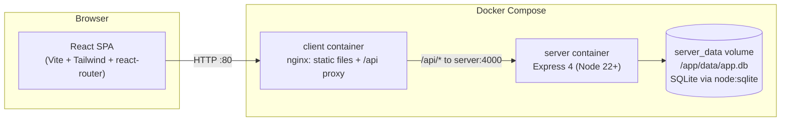
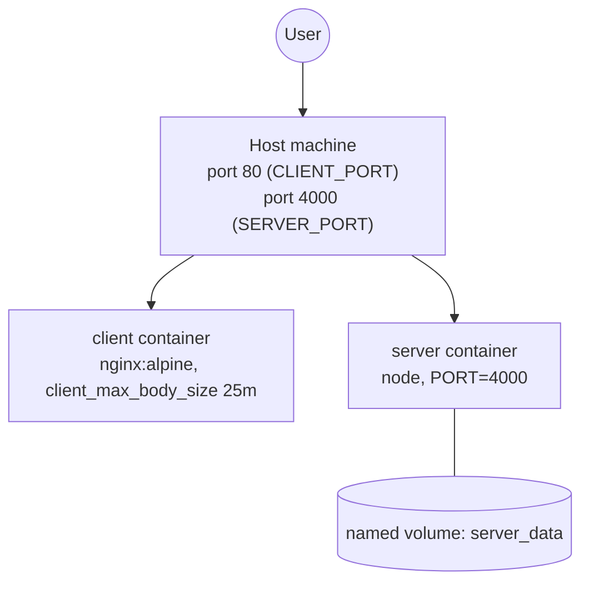
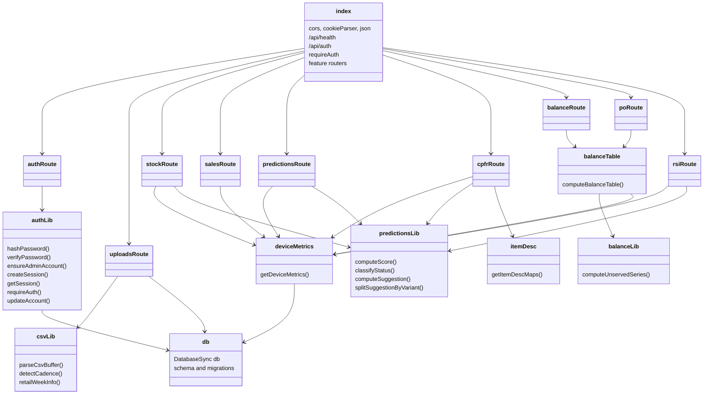
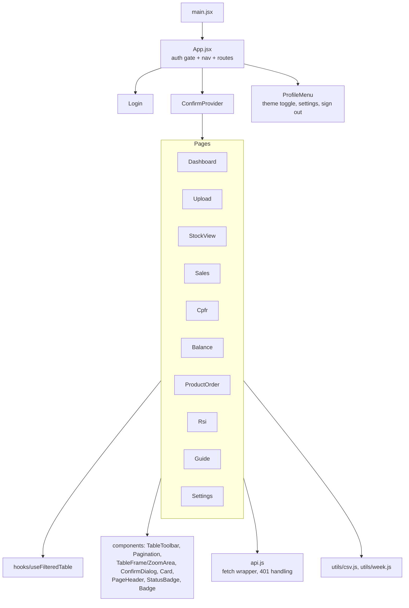
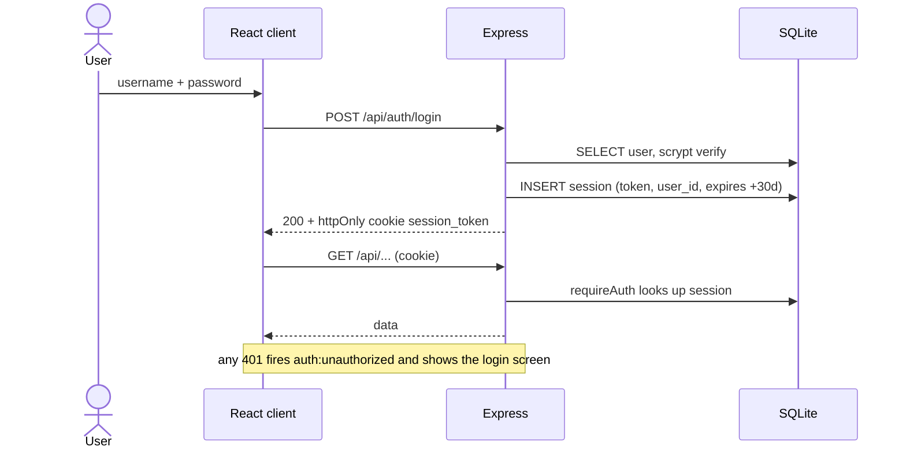
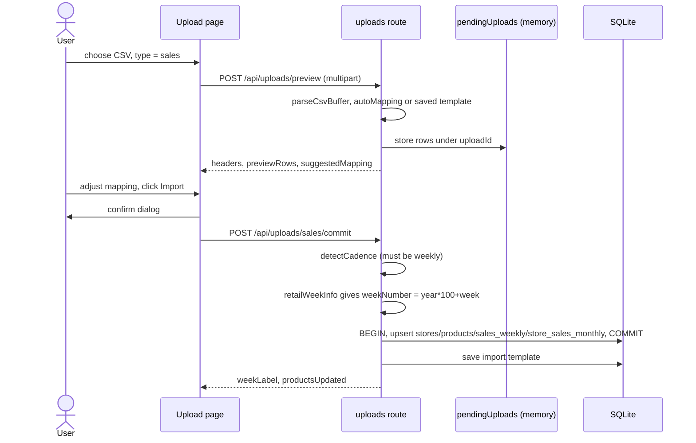
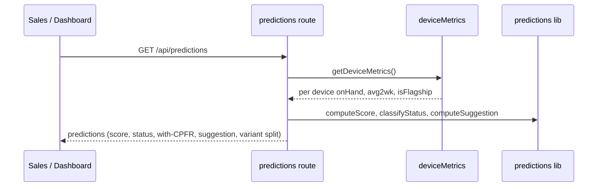
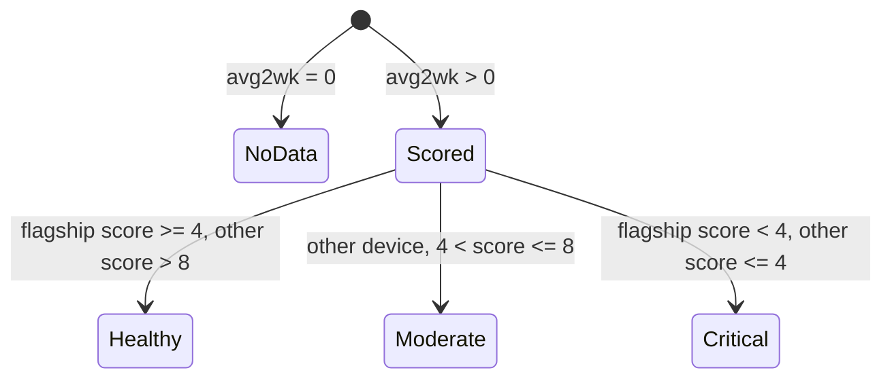

# Architecture (UML)

## 1. Component diagram

## 2. Deployment diagram

## 3. Server module diagram (class-style)

## 4. Client structure

## 5. Sequence: login

## 6. Sequence: sales upload (preview, then commit)

## 7. Sequence: prediction

## 8. State diagram: device status

