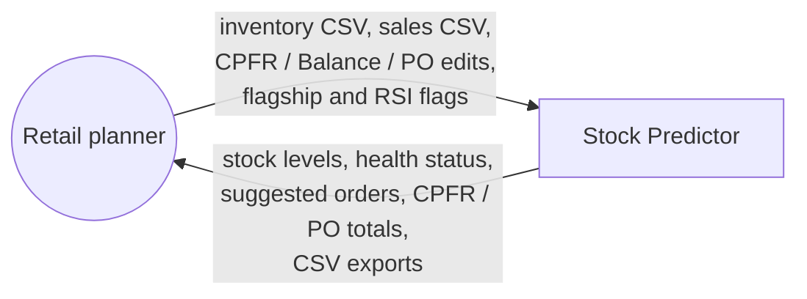
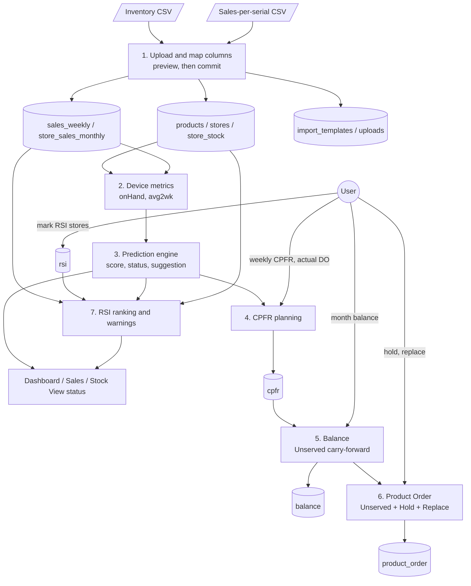
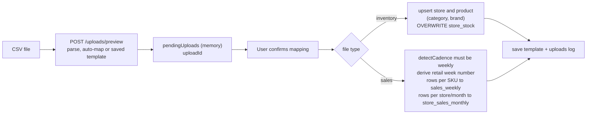
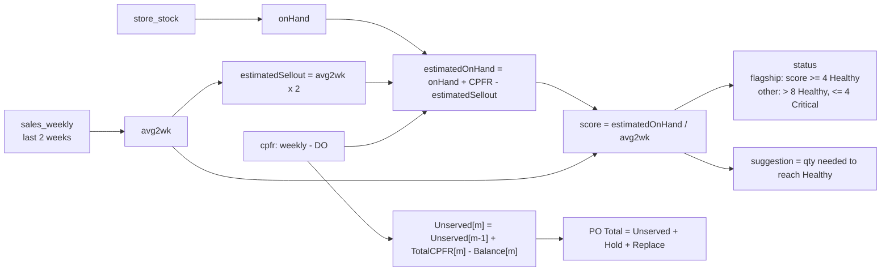

# Data-Flow Diagrams

## Level 0 – context

```mermaid
flowchart LR
  User(("Retail planner")) -- "inventory CSV, sales CSV,<br/>CPFR / Balance / PO edits,<br/>flagship and RSI flags" --> SP["Stock Predictor"]
  SP -- "stock levels, health status,<br/>suggested orders, CPFR / PO totals,<br/>CSV exports" --> User
```

## Level 1 – main processes

```mermaid
flowchart TB
  inv[/"Inventory CSV"/] --> P1["1. Upload and map columns<br/>preview, then commit"]
  sal[/"Sales-per-serial CSV"/] --> P1
  P1 --> D1[("products / stores / store_stock")]
  P1 --> D2[("sales_weekly / store_sales_monthly")]
  P1 --> D9[("import_templates / uploads")]

  D1 --> P2["2. Device metrics<br/>onHand, avg2wk"]
  D2 --> P2
  P2 --> P3["3. Prediction engine<br/>score, status, suggestion"]
  P3 --> Dash["Dashboard / Sales / Stock View status"]

  P3 --> P4["4. CPFR planning"]
  user1(("User")) -- "weekly CPFR, actual DO" --> P4
  P4 --> D3[("cpfr")]

  D3 --> P5["5. Balance<br/>Unserved carry-forward"]
  user1 -- "month balance" --> P5
  P5 --> D4[("balance")]

  P5 --> P6["6. Product Order<br/>Unserved + Hold + Replace"]
  user1 -- "hold, replace" --> P6
  P6 --> D5[("product_order")]

  user1 -- "mark RSI stores" --> D6[("rsi")]
  D2 --> P7["7. RSI ranking and warnings"]
  D6 --> P7
  P3 --> P7
  D1 --> P7
  P7 --> Dash
```

## Upload pipeline (detail)

```mermaid
flowchart LR
  A["CSV file"] --> B["POST /uploads/preview<br/>parse, auto-map or saved template"]
  B --> C["pendingUploads (memory)<br/>uploadId"]
  C --> D["User confirms mapping"]
  D --> E{"file type"}
  E -- inventory --> F["upsert store and product<br/>(category, brand)<br/>OVERWRITE store_stock"]
  E -- sales --> G["detectCadence must be weekly<br/>derive retail week number<br/>rows per SKU to sales_weekly<br/>rows per store/month to store_sales_monthly"]
  F --> H["save template + uploads log"]
  G --> H
```

## Calculation flow

```mermaid
flowchart LR
  S["sales_weekly<br/>last 2 weeks"] --> AVG["avg2wk"]
  ST["store_stock"] --> OH["onHand"]
  AVG --> ES["estimatedSellout = avg2wk x 2"]
  OH --> EO["estimatedOnHand = onHand + CPFR - estimatedSellout"]
  ES --> EO
  EO --> SC["score = estimatedOnHand / avg2wk"]
  AVG --> SC
  SC --> STAT["status<br/>flagship: score >= 4 Healthy<br/>other: > 8 Healthy, <= 4 Critical"]
  SC --> SUG["suggestion = qty needed to reach Healthy"]
  CP["cpfr: weekly - DO"] --> EO
  CP --> UN["Unserved[m] = Unserved[m-1] + TotalCPFR[m] - Balance[m]"]
  UN --> PO["PO Total = Unserved + Hold + Replace"]
```
