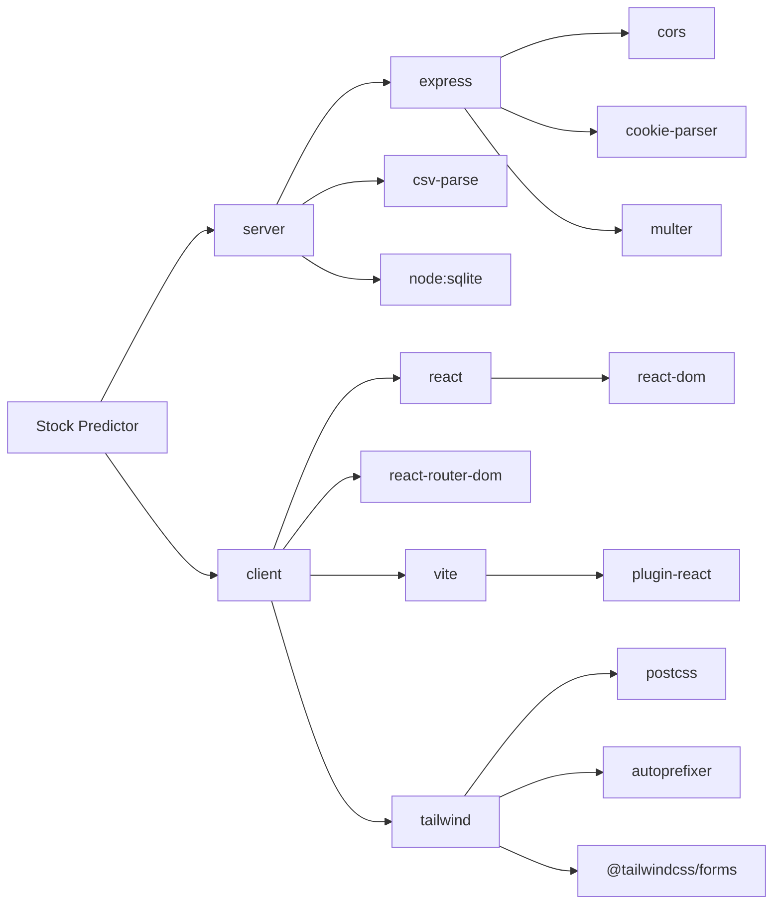

# Dependencies

## Runtime requirements
- **Docker + Docker Compose** (recommended), or
- **Node.js 22.5+** – the server uses the built-in experimental `node:sqlite` module.

## Server ([`server/package.json`](../server/package.json))

| Package | Version | Use |
|---|---|---|
| express | ^4.21.2 | HTTP API |
| cors | ^2.8.5 | CORS headers |
| cookie-parser | ^1.4.7 | Session cookie parsing |
| multer | ^2.0.1 | Multipart CSV upload (memory storage, 20 MB limit) |
| csv-parse | ^5.6.0 | CSV parsing |
| node:sqlite, node:crypto | built-in | Database; scrypt password hashing; UUIDs |

Tests use Node's built-in runner (`npm test`).

## Client ([`client/package.json`](../client/package.json))

| Package | Version | Use |
|---|---|---|
| react / react-dom | ^18.3.1 | UI |
| react-router-dom | ^7.18.3 | Routing |
| vite | ^7.3.6 | Dev server and build |
| @vitejs/plugin-react | ^4.3.4 | React support |
| tailwindcss / postcss / autoprefixer | ^3.4.19 / ^8.5.28 / ^10.6.1 | Styling (`darkMode: 'class'`) |
| @tailwindcss/forms | ^0.5.11 | Form styling |

## Root ([`package.json`](../package.json))
`concurrently` (^9.1.0) runs server and client together for `npm run dev`.

## Dependency graph

## Environment variables

| Variable | Default | Description |
|---|---|---|
| `ADMIN_USERNAME` | `admin` | Username of the admin account created on first start |
| `ADMIN_PASSWORD` | none | Password for the admin account. **Required on first start**; only used if no users exist yet |
| `CLIENT_PORT` | `80` | Host port for the web UI |
| `SERVER_PORT` | `4000` | Host port for the API |
| `PORT` | `4000` | Server listen port inside the container |

Copy [`.env.example`](../.env.example) to `.env` and set `ADMIN_PASSWORD`. `.env` is git-ignored – never commit it.

## Docker images
- `client`: Vite build served by **nginx** (`client/nginx.conf`: 25 MB upload limit, `/api/` proxy, cache headers).
- `server`: Node image running `src/index.js`; the SQLite file lives in the `server_data` volume at `/app/data`.
