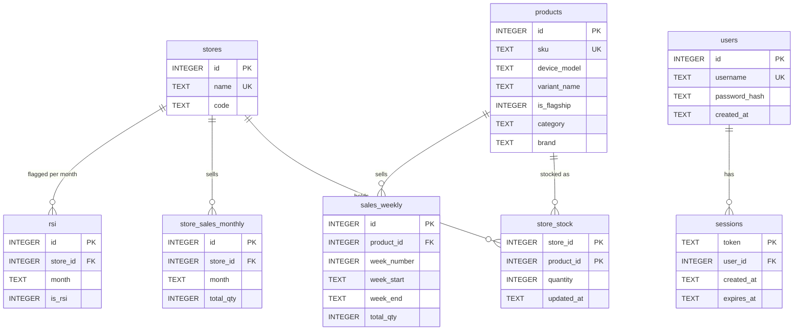
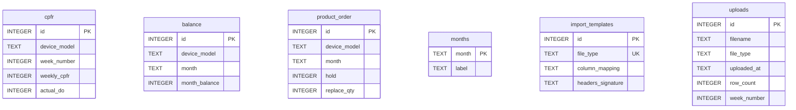

# Entity-Relationship Diagram

Database: SQLite (`node:sqlite`), file `app.db`, created and migrated in [`server/src/db.js`](../server/src/db.js).

Tables keyed by **device model**. They have no foreign key: `device_model` is matched by value to `products.device_model`.

## Table dictionary

| Table | Purpose | Unique key |
|---|---|---|
| `stores` | Retail stores, created automatically on upload | `name` |
| `products` | One row per SKU (variant). `device_model` groups variants into a device; `is_flagship` is set from Stock View | `sku` |
| `store_stock` | On-hand quantity per store per SKU; overwritten by each inventory upload | `(store_id, product_id)` |
| `sales_weekly` | Units sold per SKU per retail week | `(product_id, week_number)` |
| `store_sales_monthly` | Units sold per store per month (drives RSI ranking) | `(store_id, month)` |
| `cpfr` | Planned weekly CPFR and actual delivery orders (DO) per device | `(device_model, week_number)` |
| `balance` | Monthly balance per device (Balance page) | `(device_model, month)` |
| `product_order` | Hold and Replace quantities per device per month | `(device_model, month)` |
| `rsi` | Which stores are marked RSI for a month | `(store_id, month)` |
| `months` | Months the user has added for Balance / PO | `month` |
| `import_templates` | Remembered CSV column mappings (JSON) per file type | `file_type` |
| `uploads` | Upload history log | none |
| `users` / `sessions` | Login accounts (scrypt hash) and cookie sessions | `username` / `token` |

**Week numbers** are `retailYear*100 + retailWeek` (e.g. `202637` = 2026-W37). Retail weeks run Sunday–Saturday; week 1 starts on the Sunday on or before 1 January. `month` values are `YYYY-MM`.
